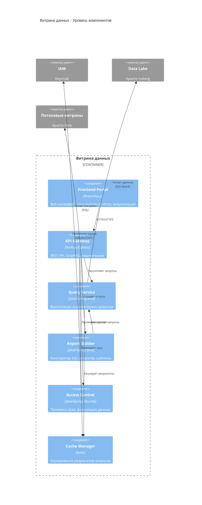
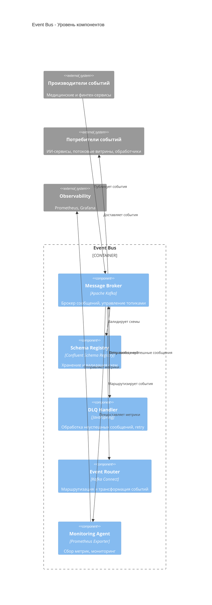
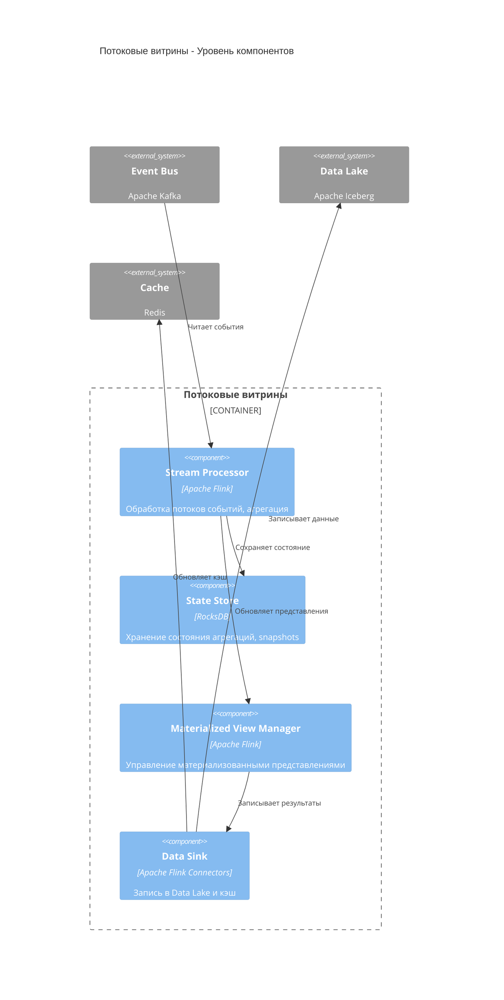

# C4-диаграмма целевой архитектуры "Будущее 2.0"

## Диаграмма уровня контейнеров

```mermaid
C4Container
    title Целевая архитектура системы "Будущее 2.0" (горизонт 3 года) - Уровень контейнеров
    
    Person(users, "Пользователи", "Сотрудники компании, врачи, аналитики")
    Person(partners, "Партнёры", "Фармацевтические компании, производители оборудования")
    
    System_Boundary(medical_domain, "Медицинский домен") {
        Container(medical_services, "Медицинские сервисы", "Java/Spring Boot, PostgreSQL", "Управление пациентами, клиниками, персоналом, инвентаризацией")
        Container(ai_services, "ИИ-сервисы", "Python/FastAPI", "Обработка медицинских данных, генерация рекомендаций")
    }
    
    System_Boundary(financial_domain, "Финансовый домен") {
        Container(fintech_services, "Финтех-сервисы", "Golang/Java, PostgreSQL", "Управление счетами, кредиты, платежи, отчётность")
    }
    
    System_Boundary(analytics_domain, "Аналитический домен") {
        Container(data_mart, "Витрина данных", "React/Node.js, Redis", "Портал самообслуживания, конструктор отчётов")
        Container(streaming_marts, "Потоковые витрины", "Apache Flink, Kafka Streams", "Агрегация данных в реальном времени")
    }
    
    System_Boundary(integration_domain, "Интеграционный домен") {
        Container(event_bus, "Event Bus", "Apache Kafka, Schema Registry", "Центральная событийная шина, DLQ")
        Container(acl, "Антикоррупционный слой", "Java/Spring Integration", "Адаптеры для легаси-систем")
    }
    
    System_Boundary(data_platform, "Платформа данных") {
        Container(data_lake, "Data Lake", "Apache Iceberg, S3", "Хранилище сырых и обработанных данных")
        Container(stream_processing, "Потоковая обработка", "Apache Flink", "Обработка событий в реальном времени")
        Container(batch_processing, "Пакетная обработка", "Apache Spark, Airflow", "ETL-процессы, историческая загрузка")
    }
    
    System_Boundary(infrastructure, "Инфраструктурные сервисы") {
        Container(api_gateway, "API Gateway", "Kong/AWS API Gateway", "Маршрутизация, аутентификация, rate limiting")
        Container(iam, "IAM", "Keycloak, OAuth2", "Аутентификация, авторизация, управление ролями")
        Container(observability, "Observability", "Prometheus, Grafana, Jaeger, ELK", "Мониторинг, логирование, трейсинг")
        Container(k8s, "Kubernetes", "K8s", "Оркестрация контейнеров, автомасштабирование")
    }
    
    System_Ext(legacy_dwh, "Legacy DWH", "SQL Server 2008", "Старое хранилище данных (на этапе миграции)")
    System_Ext(legacy_camel, "Legacy Camel", "Apache Camel", "Старая шина данных (на этапе миграции)")
    
    Rel(users, data_mart, "Использует", "HTTPS")
    Rel(partners, api_gateway, "Интегрируется", "REST API")
    Rel(api_gateway, fintech_services, "Маршрутизирует запросы")
    Rel(api_gateway, medical_services, "Маршрутизирует запросы")
    
    Rel(medical_services, event_bus, "Публикует события")
    Rel(fintech_services, event_bus, "Публикует события")
    Rel(ai_services, event_bus, "Подписывается на события")
    Rel(streaming_marts, event_bus, "Подписывается на события")
    Rel(stream_processing, event_bus, "Читает события")
    
    Rel(stream_processing, data_lake, "Записывает обработанные данные")
    Rel(streaming_marts, data_lake, "Записывает агрегации")
    Rel(batch_processing, data_lake, "Читает/записывает данные")
    Rel(data_mart, data_lake, "Читает данные для отчётов")
    Rel(data_mart, streaming_marts, "Читает предрасчитанные метрики")
    
    Rel(acl, event_bus, "Публикует события из легаси")
    Rel(acl, legacy_dwh, "Читает данные")
    Rel(acl, legacy_camel, "Интегрируется")
    
    Rel(medical_services, iam, "Проверяет доступ")
    Rel(fintech_services, iam, "Проверяет доступ")
    Rel(data_mart, iam, "Проверяет доступ")
    
    Rel(medical_services, observability, "Отправляет метрики и логи")
    Rel(fintech_services, observability, "Отправляет метрики и логи")
    Rel(event_bus, observability, "Отправляет метрики")
    Rel(stream_processing, observability, "Отправляет метрики")
    
    Rel(medical_services, k8s, "Развёрнут на")
    Rel(fintech_services, k8s, "Развёрнут на")
    Rel(ai_services, k8s, "Развёрнут на")
    Rel(data_mart, k8s, "Развёрнут на")
    Rel(event_bus, k8s, "Развёрнут на")
    Rel(stream_processing, k8s, "Развёрнут на")
    
    UpdateElementStyle(legacy_dwh, $bgColor="#ffcccc", $borderColor="#ff0000")
    UpdateElementStyle(legacy_camel, $bgColor="#ffcccc", $borderColor="#ff0000")
    UpdateElementStyle(acl, $bgColor="#ffffcc", $borderColor="#ffaa00")
```

## Диаграмма уровня компонентов: Витрина данных

## Диаграмма уровня компонентов: Event Bus

## Диаграмма уровня компонентов: Потоковые витрины

## Легенда

- **Синие контейнеры**: Основные бизнес-сервисы
- **Зелёные контейнеры**: Платформа данных
- **Жёлтые контейнеры**: Инфраструктурные сервисы
- **Красные контейнеры**: Легаси-системы (на этапе миграции)
- **Оранжевые контейнеры**: Антикоррупционный слой

## Ключевые принципы архитектуры

1. **Событийная архитектура**: Все домены взаимодействуют через Event Bus
2. **Доменная изоляция**: Каждый домен имеет независимые БД и сервисы
3. **Масштабируемость**: Горизонтальное масштабирование через Kubernetes
4. **Безопасность**: Единая система IAM, шифрование, аудит
5. **Наблюдаемость**: Централизованный мониторинг всех компонентов
6. **Геораспределённость**: Поддержка мультирегионального развёртывания
