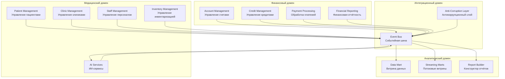

# Bounded Contexts системы "Будущее 2.0"

## Обзор доменов

Система разделена на 4 основных домена с четкими границами и ответственностью:

1. **Медицинский домен** - управление медицинскими процессами
2. **Финансовый домен** - управление финансовыми операциями
3. **Аналитический домен** - обработка и представление аналитических данных
4. **Интеграционный домен** - обеспечение взаимодействия между доменами

## Схема Bounded Contexts

## Детальное описание Bounded Contexts

### Медицинский домен

#### 1. Patient Management (Управление пациентами)
**Ответственность:**
- Регистрация и управление данными пациентов
- Ведение медицинских карт (без результатов исследований для аналитики)
- Управление записями на приём

**Ключевые агрегаты:**
- Patient (Пациент)
- MedicalRecord (Медицинская карта)
- Appointment (Запись на приём)

**События:**
- PatientRegistered
- PatientUpdated
- AppointmentCreated
- AppointmentCompleted

#### 2. Clinic Management (Управление клиниками)
**Ответственность:**
- Управление информацией о клиниках
- Управление расписанием работы
- Управление кабинетами и оборудованием

**Ключевые агрегаты:**
- Clinic (Клиника)
- Schedule (Расписание)
- Room (Кабинет)

**События:**
- ClinicCreated
- ScheduleUpdated
- RoomAssigned

#### 3. Staff Management (Управление персоналом)
**Ответственность:**
- Управление данными сотрудников
- Управление ролями и правами доступа
- Управление расписанием работы персонала

**Ключевые агрегаты:**
- Staff (Персонал)
- Role (Роль)
- WorkSchedule (Рабочее расписание)

**События:**
- StaffRegistered
- StaffRoleChanged
- WorkScheduleUpdated

#### 4. Inventory Management (Управление инвентаризацией)
**Ответственность:**
- Управление медицинским оборудованием
- Управление расходными материалами
- Учёт движения инвентаря

**Ключевые агрегаты:**
- Equipment (Оборудование)
- Supply (Расходные материалы)
- InventoryTransaction (Транзакция инвентаря)

**События:**
- EquipmentRegistered
- SupplyReceived
- InventoryTransactionCreated

#### 5. AI Services (ИИ-сервисы)
**Ответственность:**
- Обработка медицинских данных с помощью ИИ
- Генерация рекомендаций по диагностике
- Анализ результатов исследований

**Ключевые агрегаты:**
- AIAnalysis (ИИ-анализ)
- Recommendation (Рекомендация)

**События:**
- AIAnalysisCompleted
- RecommendationGenerated
- ResearchProcessed

### Финансовый домен

#### 6. Account Management (Управление счетами)
**Ответственность:**
- Управление банковскими счетами клиентов
- Управление балансами
- История операций по счетам

**Ключевые агрегаты:**
- Account (Счёт)
- Balance (Баланс)
- Transaction (Транзакция)

**События:**
- AccountCreated
- AccountBalanceUpdated
- TransactionCompleted

#### 7. Credit Management (Управление кредитами)
**Ответственность:**
- Оформление кредитных договоров
- Управление кредитными лимитами
- Расчёт процентов и погашений

**Ключевые агрегаты:**
- CreditContract (Кредитный договор)
- CreditLimit (Кредитный лимит)
- PaymentSchedule (График платежей)

**События:**
- CreditContractCreated
- CreditLimitChanged
- PaymentDue
- CreditRepaid

#### 8. Payment Processing (Обработка платежей)
**Ответственность:**
- Обработка платежей за медицинские услуги
- Обработка переводов между счетами
- Управление платежными методами

**Ключевые агрегаты:**
- Payment (Платеж)
- PaymentMethod (Платежный метод)

**События:**
- PaymentInitiated
- PaymentProcessed
- PaymentFailed

#### 9. Financial Reporting (Финансовая отчётность)
**Ответственность:**
- Формирование финансовых отчётов
- Агрегация финансовых метрик
- Расчёт KPI

**Ключевые агрегаты:**
- FinancialReport (Финансовый отчёт)
- FinancialMetric (Финансовая метрика)

**События:**
- FinancialReportGenerated
- FinancialMetricCalculated

### Аналитический домен

#### 10. Data Mart (Витрина данных)
**Ответственность:**
- Предоставление данных для аналитики
- Кэширование часто запрашиваемых данных
- Управление доступом к данным

**Ключевые агрегаты:**
- DataView (Представление данных)
- CacheEntry (Кэш-запись)

**События:**
- DataViewRefreshed
- CacheInvalidated

#### 11. Streaming Marts (Потоковые витрины)
**Ответственность:**
- Агрегация данных в реальном времени
- Предрасчёт метрик
- Обновление материализованных представлений

**Ключевые агрегаты:**
- StreamingAggregate (Потоковая агрегация)
- MaterializedView (Материализованное представление)

**События:**
- AggregateUpdated
- MaterializedViewRefreshed

#### 12. Report Builder (Конструктор отчётов)
**Ответственность:**
- Создание пользовательских отчётов
- Сохранение шаблонов отчётов
- Выполнение аналитических запросов

**Ключевые агрегаты:**
- Report (Отчёт)
- ReportTemplate (Шаблон отчёта)
- Query (Запрос)

**События:**
- ReportCreated
- ReportExecuted
- QueryCompleted

### Интеграционный домен

#### 13. Event Bus (Событийная шина)
**Ответственность:**
- Маршрутизация событий между доменами
- Управление схемами событий
- Обработка DLQ

**Ключевые компоненты:**
- Message Broker
- Schema Registry
- DLQ Handler

#### 14. Anti-Corruption Layer (Антикоррупционный слой)
**Ответственность:**
- Адаптация данных из легаси-систем
- Синхронизация с DWH
- Синхронизация с Camel шиной

**Ключевые компоненты:**
- Legacy Adapters
- Data Transformers
- Sync Services

## Взаимодействие между Bounded Contexts

### Принципы взаимодействия:
1. **Асинхронное взаимодействие** - через события через Event Bus
2. **Изоляция данных** - каждый BC имеет свою БД
3. **Слабая связанность** - BC не знают о внутренней структуре других BC
4. **Eventual Consistency** - данные синхронизируются асинхронно

### Основные потоки событий:

**Медицинский → Финансовый:**
- AppointmentCompleted → PaymentInitiated (автоматическое создание платежа за услугу)

**Медицинский → Аналитический:**
- PatientRegistered → AggregateUpdated (обновление метрик по пациентам)
- AppointmentCompleted → MaterializedViewRefreshed (обновление статистики приёмов)

**Финансовый → Аналитический:**
- PaymentProcessed → AggregateUpdated (обновление финансовых метрик)
- CreditContractCreated → MaterializedViewRefreshed (обновление кредитной статистики)

**Медицинский → ИИ-сервисы:**
- ResearchProcessed → AIAnalysisRequested (запрос на ИИ-анализ)

**ИИ-сервисы → Медицинский:**
- AIAnalysisCompleted → RecommendationGenerated (рекомендации для врачей)

## Стратегии интеграции

### Shared Kernel
Не используется - каждый BC полностью изолирован.

### Customer-Supplier
- Медицинский домен - поставщик данных для Аналитического домена
- Финансовый домен - поставщик данных для Аналитического домена

### Conformist
- Антикоррупционный слой конформируется с легаси-системами (DWH, Camel)

### Anti-Corruption Layer
- Используется для интеграции с легаси-системами

### Separate Ways
- ИИ-сервисы могут работать независимо от основного медицинского домена

### Open Host Service
- Event Bus выступает как открытый хост-сервис для всех доменов
