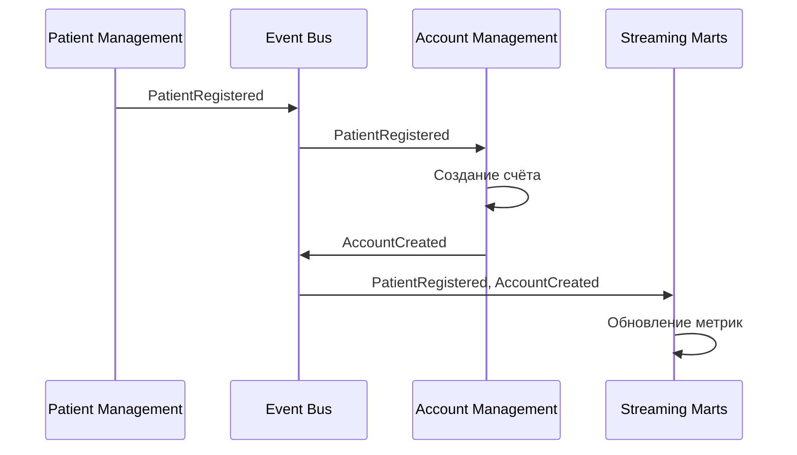
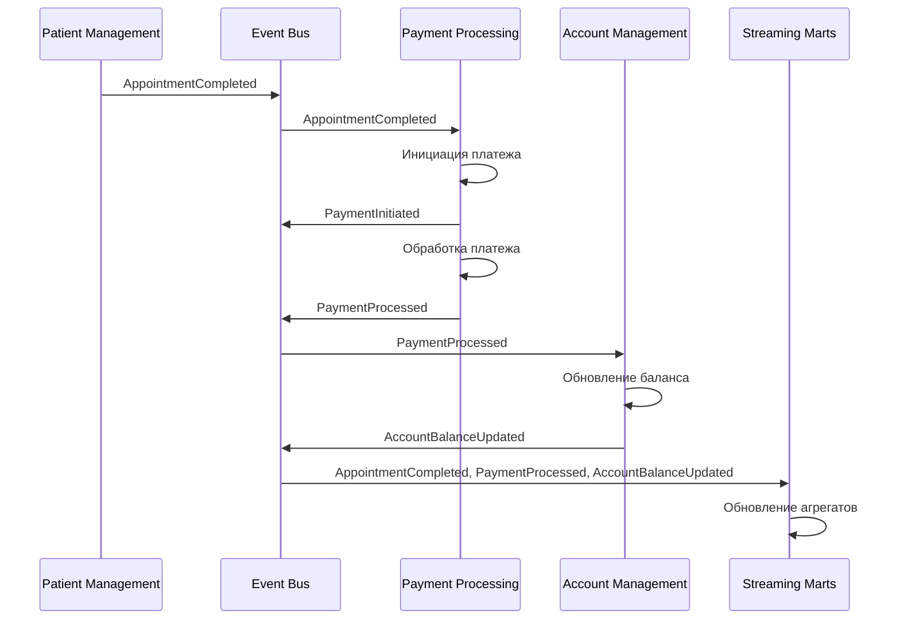
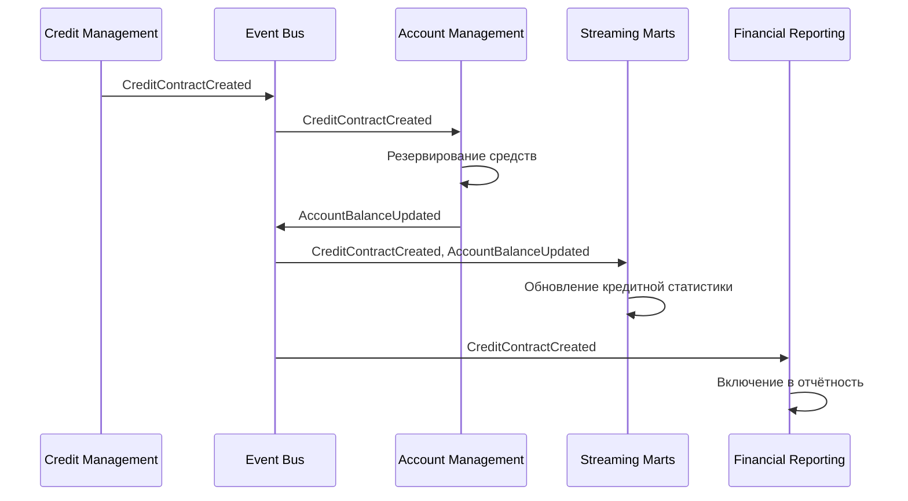
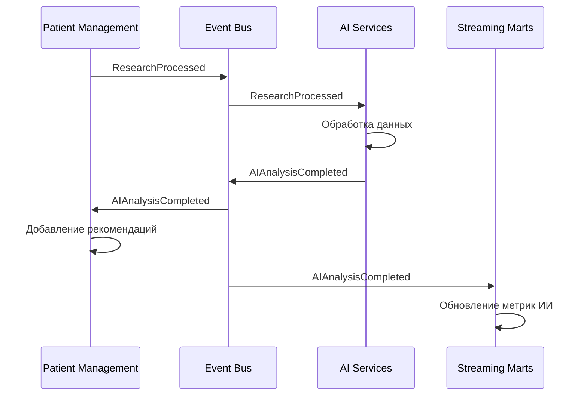
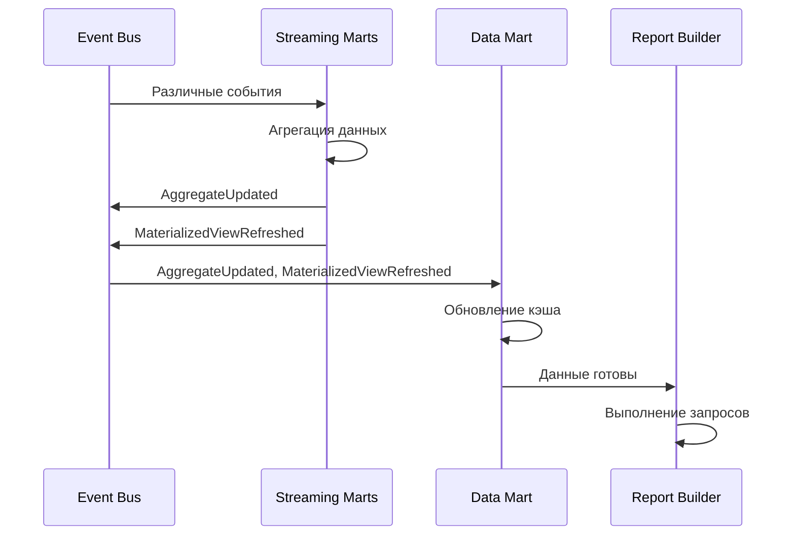

# Event Storming диаграмма системы "Будущее 2.0"

## Обзор

Event Storming диаграмма показывает основные события, публикуемые доменами, и их подписчиков. События организованы по доменам и показывают потоки данных между ними.

## Диаграмма Event Storming

```mermaid
graph TB
    subgraph Medical["Медицинский домен"]
        E1[PatientRegistered]
        E2[PatientUpdated]
        E3[AppointmentCreated]
        E4[AppointmentCompleted]
        E5[AppointmentCancelled]
        E6[ClinicCreated]
        E7[ScheduleUpdated]
        E8[StaffRegistered]
        E9[StaffRoleChanged]
        E10[EquipmentRegistered]
        E11[AIAnalysisCompleted]
        E12[ResearchProcessed]
    end
    
    subgraph Financial["Финансовый домен"]
        E13[AccountCreated]
        E14[AccountBalanceUpdated]
        E15[TransactionCompleted]
        E16[CreditContractCreated]
        E17[CreditLimitChanged]
        E18[PaymentDue]
        E19[CreditRepaid]
        E20[PaymentInitiated]
        E21[PaymentProcessed]
        E22[PaymentFailed]
        E23[FinancialReportGenerated]
    end
    
    subgraph Analytics["Аналитический домен"]
        E24[AggregateUpdated]
        E25[MaterializedViewRefreshed]
        E26[ReportCreated]
        E27[QueryCompleted]
    end
    
    subgraph EventBus["Event Bus<br/>Центральная шина событий"]
        EB[Kafka Cluster<br/>Schema Registry<br/>DLQ Handler]
    end
    
    subgraph Legacy["Легаси-системы"]
        L1[DWH SQL Server]
        L2[Apache Camel]
    end
    
    subgraph ACL["Антикоррупционный слой"]
        ACL1[Legacy Adapters]
    end
    
    %% Медицинский домен публикует события
    E1 --> EB
    E2 --> EB
    E3 --> EB
    E4 --> EB
    E5 --> EB
    E6 --> EB
    E7 --> EB
    E8 --> EB
    E9 --> EB
    E10 --> EB
    E11 --> EB
    E12 --> EB
    
    %% Финансовый домен публикует события
    E13 --> EB
    E14 --> EB
    E15 --> EB
    E16 --> EB
    E17 --> EB
    E18 --> EB
    E19 --> EB
    E20 --> EB
    E21 --> EB
    E22 --> EB
    E23 --> EB
    
    %% Аналитический домен публикует события
    E24 --> EB
    E25 --> EB
    E26 --> EB
    E27 --> EB
    
    %% Подписки аналитического домена
    EB -->|PatientRegistered| E24
    EB -->|AppointmentCompleted| E24
    EB -->|PaymentProcessed| E24
    EB -->|CreditContractCreated| E24
    EB -->|AccountBalanceUpdated| E24
    EB -->|TransactionCompleted| E24
    
    %% Подписки финансового домена
    EB -->|AppointmentCompleted| E20
    EB -->|PaymentDue| E20
    
    %% Подписки медицинского домена (ИИ-сервисы)
    EB -->|ResearchProcessed| E11
    EB -->|AppointmentCompleted| E12
    
    %% Легаси интеграции
    ACL1 --> EB
    L1 --> ACL1
    L2 --> ACL1
    
    style Medical fill:#e1f5ff
    style Financial fill:#ffe1f5
    style Analytics fill:#fff5e1
    style EventBus fill:#f0f0f0
    style Legacy fill:#ffcccc
    style ACL fill:#ffffcc
```

## Детальная схема потоков событий

### Поток 1: Регистрация пациента и создание счёта

### Поток 2: Завершение приёма и обработка платежа

### Поток 3: Создание кредитного договора

### Поток 4: ИИ-анализ медицинских данных

### Поток 5: Обновление аналитических витрин

## Матрица событий и подписчиков

| Событие | Источник | Подписчики |
|---------|----------|------------|
| PatientRegistered | Patient Management | Account Management, Streaming Marts |
| AppointmentCreated | Patient Management | Streaming Marts |
| AppointmentCompleted | Patient Management | Payment Processing, Streaming Marts, AI Services |
| AccountCreated | Account Management | Streaming Marts |
| AccountBalanceUpdated | Account Management | Credit Management, Streaming Marts |
| PaymentInitiated | Payment Processing | Account Management, Streaming Marts |
| PaymentProcessed | Payment Processing | Account Management, Streaming Marts, Financial Reporting |
| CreditContractCreated | Credit Management | Account Management, Streaming Marts, Financial Reporting |
| PaymentDue | Credit Management | Payment Processing |
| AIAnalysisCompleted | AI Services | Patient Management, Streaming Marts |
| ResearchProcessed | AI Services | Patient Management |
| AggregateUpdated | Streaming Marts | Data Mart, Report Builder |
| MaterializedViewRefreshed | Streaming Marts | Data Mart |

## Ключевые паттерны взаимодействия

### 1. Command-Query Responsibility Segregation (CQRS)
- **Команды** (изменения) обрабатываются в доменах-источниках
- **Запросы** (чтение) выполняются через аналитические витрины
- События синхронизируют данные между командами и запросами

### 2. Event Sourcing (частично)
- Ключевые агрегаты сохраняют события изменений
- История изменений доступна через события
- Восстановление состояния через replay событий

### 3. Saga Pattern
- Длинные транзакции (например, создание счёта при регистрации пациента) выполняются через цепочку событий
- Компенсирующие действия при ошибках через события отката

### 4. Event-Driven Architecture
- Все домены взаимодействуют асинхронно через события
- Слабая связанность между доменами
- Масштабируемость через горизонтальное масштабирование обработчиков

## Интеграция с легаси-системами

### Антикоррупционный слой
- **Источник:** DWH SQL Server, Apache Camel
- **Назначение:** Преобразование данных из легаси-форматов в события
- **События:** Публикует события на основе изменений в DWH и сообщений из Camel

### Миграционная стратегия
1. **Фаза 1:** Антикоррупционный слой читает из DWH/Camel и публикует события
2. **Фаза 2:** Новые домены подписываются на события и обновляют свои БД
3. **Фаза 3:** Постепенный отказ от прямого доступа к DWH
4. **Фаза 4:** Полный переход на событийную архитектуру

## Мониторинг и наблюдаемость

### Метрики событий
- Количество событий по типам
- Задержка обработки событий (latency)
- Пропускная способность (throughput)
- Ошибки обработки (DLQ размер)

### Трейсинг
- Correlation ID для отслеживания цепочек событий
- Distributed tracing через все домены
- Логирование всех событий для аудита

## Безопасность событий

### Шифрование
- События шифруются при передаче (TLS)
- Чувствительные данные маскируются в событиях
- PII данные не включаются в события аналитики

### Авторизация
- Подписчики проверяют права доступа к событиям
- Фильтрация событий по уровням доступа
- Аудит доступа к событиям
